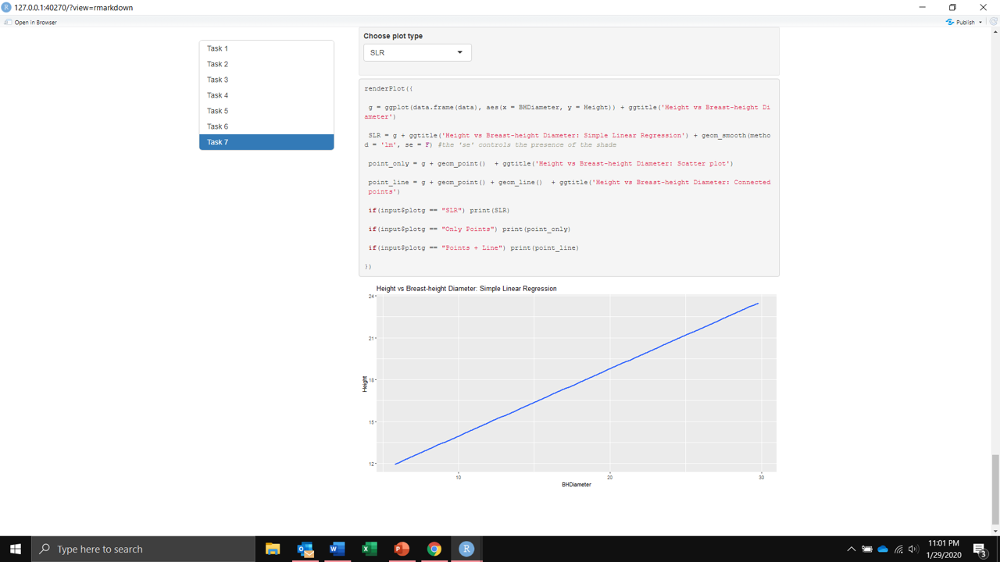
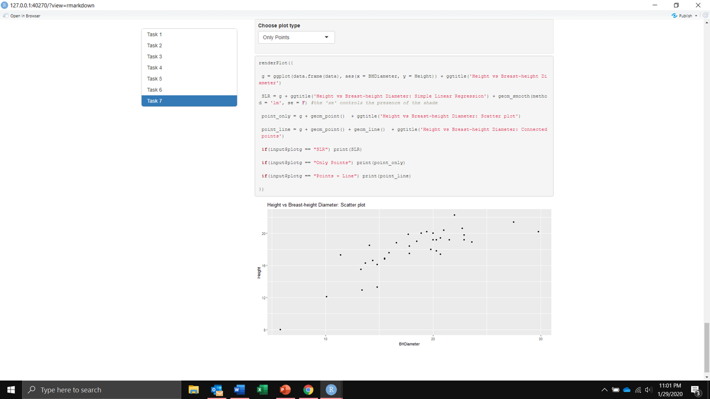
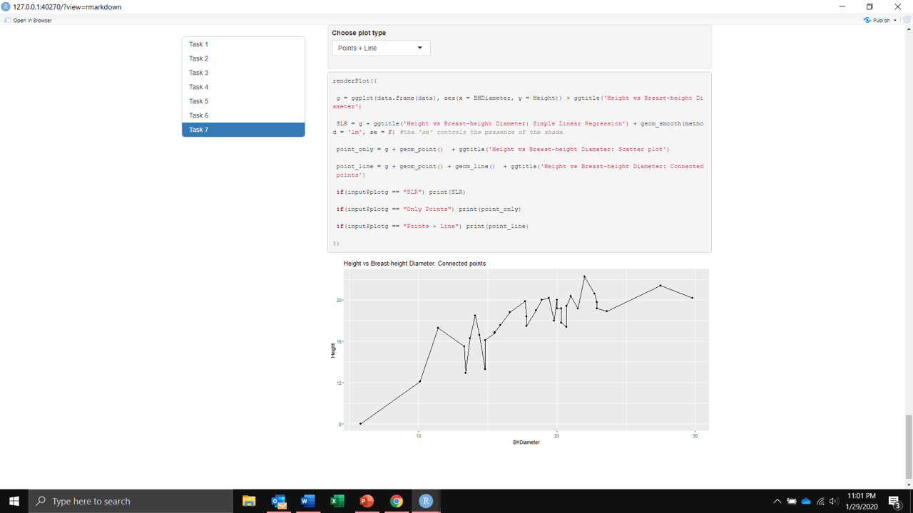

```{r setup, include=FALSE}
knitr::opts_chunk$set(echo = TRUE, comment = 'ra#')
```

# Task 1

Check working directory

```{r}

getwd()

```

# Task 2

Import data and check structure

```{r}

data = read.csv('SPRUCE.csv')
head(data)

```

# Task 3

Plot scatter plot of Height vs BHDiamater. Some Lowess plots are also shown below. 

```{r}

x = data[,1]
y = data[,2]

plot(y~x, bg = 'Blue', pch = 21, cex = 1.2, xlim = c(0,1.1*max(x)), ylim = c(0,1.1*max(y)), 
    xlab = 'BHDiameter', ylab = 'Height', main = 'modeling tree height with diameter')

print('Straight line relationship between BHDiamater and Height seems possible')

library(s20x)

loca = matrix(1:4, nr = 2)
layout(loca)

  for(i in c(0.2, 0.4, 0.6, 0.8)){
    par(pty="m")
    trendscatter(y~x, f = i, main = '')
    title(main = paste('Lowess with f =', i))
  }

```

```{r}

spruce.lm = lm(y~x)

plot(y~x, bg = 'Blue', pch = 21, cex = 1.2, xlim = c(0,1.1*max(x)), ylim = c(0,1.1*max(y)), 
    xlab = 'BHDiameter', ylab = 'Height', main = 'modeling tree height with diameter')

abline(spruce.lm)

```

The straight line seems fine except for some points with extremely low or high BHDiameter. The curve first with Lowess seems to fit better from a naked eye.

# Task 4

Here plots showing various squared errors are shown

```{r}

loca1 = matrix(1:4, nr = 2, byrow = T)
layout(loca1)
#layout.show(4)

#1 only fitted line
par(pty = 'm')
plot(y~x, bg = 'Blue', pch = 21, cex = 1.2, xlim = c(0,1.1*max(x)), ylim = c(0,1.1*max(y)), 
    xlab = 'BHDiameter', ylab = 'Height', main = 'Fitted Line')

abline(spruce.lm)

#2 fitted line with error to the fitted line
plot(y~x, bg = 'Blue', pch = 21, cex = 1.2, xlim = c(0,1.1*max(x)), ylim = c(0,1.1*max(y)), 
    xlab = 'BHDiameter', ylab = 'Height', main = 'RSS')

yhat = predict(spruce.lm, data.frame(x))
yhat = fitted(spruce.lm)
segments(x,y,x,yhat)
abline(spruce.lm)
RSS = sum((y - yhat)^2)


#3 
plot(y~x, bg = 'Blue', pch = 21, cex = 1.2, xlim = c(0,1.1*max(x)), ylim = c(0,1.1*max(y)), 
    xlab = 'BHDiameter', ylab = 'Height', main = 'MSS')

ref = mean(y)
abline(h = ref, spruce.lm)
segments(x,ref,x,yhat, col = 'red')
MSS = sum((yhat - ref)^2)

#4 
plot(y~x, bg = 'Blue', pch = 21, cex = 1.2, xlim = c(0,1.1*max(x)), ylim = c(0,1.1*max(y)), 
    xlab = 'BHDiameter', ylab = 'Height', main = 'TSS')

abline(h = ref)
segments(x,y,x,ref, col = 'green')
TSS = sum((y - ref)^2)

#round(TSS, digits = 4) == round(MSS + RSS, digits = 4)

```

RSS = 95.7028

MSS = 183.2447

TSS = 278.9473

MSS/TSS = 0.6569, this is the multiple R2 value

It is true that TSS = MSS + RSS

# Task 5

Get quick summary of linear regression model on spruce dataframe

```{r}

summary(spruce.lm)

```

value of the slope = 0.4815

value of the intercept = 9.1468

equation of the fitted line is

$$y = 9.1468 + 0.4815x$$
```{r}

predict(spruce.lm, data.frame(x = c(15, 18, 20)))

```


# Task 6

Use ggplot for visualization

```{r}

library(ggplot2)

g = ggplot(data.frame(data), aes(x = BHDiameter, y = Height, colour = BHDiameter)) 
g + geom_point() + geom_line() + geom_smooth(method="lm") + ggtitle('Height vs BHDiameter')


```

# Task 7
The following are the screenshots of plot presentation using Shiny. 

<center>
{ width=70% }


{ width=70% }


{ width=70% }


{ width=70% }


</center>


